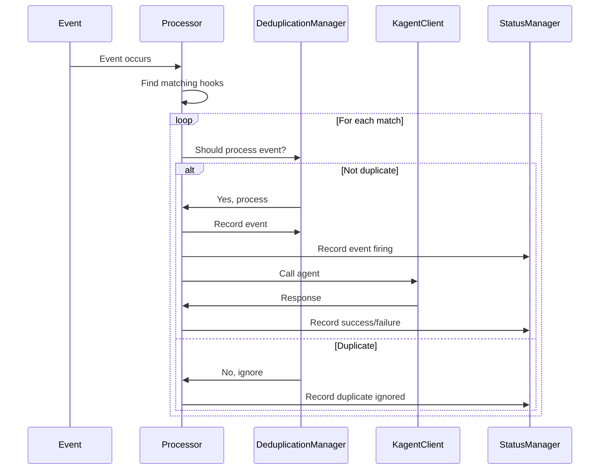

# Event Processing Pipeline

The event processing pipeline is the core component that integrates the EventWatcher, DeduplicationManager, KagentClient, and StatusManager to provide complete event processing functionality for the KAgent Hook Controller.

## Overview

The pipeline processes Kubernetes events through the following workflow:

1. **Event Matching**: Finds hook configurations that match incoming events
2. **Deduplication**: Checks if the event should be processed or ignored based on timing
3. **Agent Invocation**: Calls the appropriate Kagent agent with event context
4. **Status Management**: Updates hook status and records audit events
5. **Error Handling**: Handles failures gracefully and continues processing other events

## Components

### Processor

The `Processor` is the main component that orchestrates the entire pipeline:

```go
type Processor struct {
    eventWatcher         interfaces.EventWatcher
    deduplicationManager interfaces.DeduplicationManager
    kagentClient         interfaces.KagentClient
    statusManager        interfaces.StatusManager
}
```

### Key Methods

#### ProcessEvent

Processes a single event against all provided hooks:

```go
func (p *Processor) ProcessEvent(ctx context.Context, event interfaces.Event, hooks []*v1alpha2.Hook) error
```

- Finds matching hook configurations for the event
- Processes each match through the complete pipeline
- Continues processing even if individual matches fail
- Returns the last error encountered (if any)

#### ProcessEventWorkflow

Handles the complete event processing workflow with periodic cleanup:

```go
func (p *Processor) ProcessEventWorkflow(ctx context.Context, eventTypes []string, hooks []*v1alpha2.Hook) error
```

- Starts event watching for specified event types
- Processes events as they arrive
- Performs periodic cleanup of expired events (every 5 minutes)
- Updates hook statuses periodically (every 1 minute)

## Event Processing Flow



## Event Matching Logic

The processor matches events to hook configurations based on:

1. **Event Type**: Must exactly match the `eventType` in the hook configuration
2. **Multiple Configurations**: A single hook can have multiple event configurations
3. **Multiple Hooks**: Multiple hooks can match the same event type

Example:
```yaml
apiVersion: kagent.dev/v1alpha2
kind: Hook
metadata:
  name: multi-event-hook
spec:
  eventConfigurations:
  - eventType: pod-restart
    agentId: restart-agent
    prompt: "Pod {{.ResourceName}} restarted"
  - eventType: oom-kill
    agentId: oom-agent
    prompt: "OOM kill detected for {{.ResourceName}}"
```

## Prompt Template Expansion

The processor supports template expansion in prompts using Go template syntax:

- `{{.EventType}}`: The type of event (e.g., "pod-restart")
- `{{.ResourceName}}`: Name of the affected Kubernetes resource
- `{{.Namespace}}`: Namespace of the resource
- `{{.Reason}}`: Kubernetes event reason
- `{{.Message}}`: Kubernetes event message
- `{{.Timestamp}}`: Event timestamp in RFC3339 format

Example:
```
"Event {{.EventType}} occurred for {{.ResourceName}} in {{.Namespace}} at {{.Timestamp}}"
```

## Error Handling

The pipeline implements robust error handling:

1. **Individual Match Failures**: If one hook configuration fails, others continue processing
2. **Agent Call Failures**: Recorded in status and logs, but don't stop other processing
3. **Status Recording Failures**: Logged but don't interrupt the main flow
4. **Deduplication Failures**: Return early to prevent duplicate processing

## Deduplication

Events are deduplicated based on:

- **Hook Name**: Each hook maintains its own deduplication state
- **Event Key**: Combination of event type, namespace, and resource name
- **Timeout**: Events are considered resolved after 10 minutes
- **Status Tracking**: Events are marked as "firing" or "resolved"

## Testing

The package includes comprehensive tests:

### Unit Tests (`processor_test.go`)
- Individual method testing with mocks
- Error scenario testing
- Template expansion testing
- Status update testing

### Integration Tests (`integration_test.go`)
- Complete pipeline testing with real components
- Multi-hook scenarios
- Error handling with partial failures
- Deduplication behavior testing

Run tests:
```bash
go test ./internal/pipeline/... -v
```

## Usage Example

```go
// Create components
eventWatcher := event.NewWatcher(k8sClient, namespace)
deduplicationManager := deduplication.NewManager()
kagentClient := client.NewClient(config, logger)
statusManager := status.NewManager(k8sClient, eventRecorder)

// Create processor
processor := pipeline.NewProcessor(
    eventWatcher,
    deduplicationManager,
    kagentClient,
    statusManager,
)

// Process events
ctx := context.Background()
eventTypes := []string{"pod-restart", "oom-kill", "pod-pending", "probe-failed"}
hooks := getHooksFromCluster() // Your hook retrieval logic

err := processor.ProcessEventWorkflow(ctx, eventTypes, hooks)
if err != nil {
    log.Error(err, "Event processing workflow failed")
}
```

## Performance Considerations

- **Concurrent Processing**: Events are processed sequentially to maintain order and prevent race conditions
- **Memory Usage**: Deduplication manager uses in-memory storage with automatic cleanup
- **Error Recovery**: Failed agent calls don't block other processing
- **Periodic Cleanup**: Expired events are cleaned up every 5 minutes to prevent memory leaks