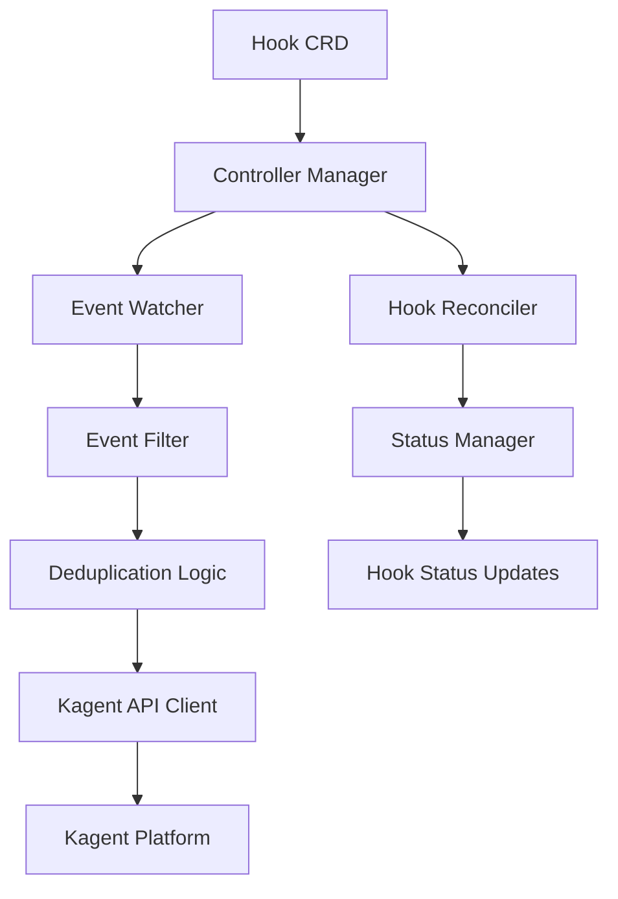
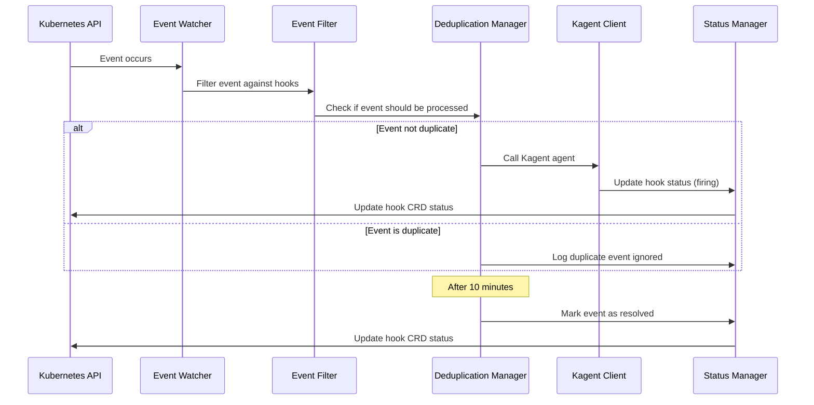

# Design Document

## Overview

The KAgent Hook Controller is a Kubernetes controller that implements the standard controller pattern to watch for Kubernetes events and trigger Kagent agents based on configurable hook definitions. The controller uses a Custom Resource Definition (CRD) to define hook configurations and maintains event state to implement deduplication logic.

## Architecture

The system follows the standard Kubernetes controller architecture with the following key components:



### Core Components

1. **Hook Custom Resource**: Defines the hook configuration schema
2. **Controller Manager**: Orchestrates the controller lifecycle and watches
3. **Event Watcher**: Monitors Kubernetes events using the Events API
4. **Hook Reconciler**: Manages hook object lifecycle and configuration
5. **Event Filter**: Matches incoming events against hook configurations
6. **Deduplication Logic**: Implements 10-minute timeout logic for event suppression
7. **Kagent API Client**: Handles communication with the Kagent platform
8. **Status Manager**: Updates hook object status with event information

## Components and Interfaces

### Hook Custom Resource Definition

The Hook CRD defines the schema for hook configurations:```y
aml
apiVersion: apiextensions.k8s.io/v1
kind: CustomResourceDefinition
metadata:
  name: hooks.kagent.dev
spec:
  group: kagent.dev
  versions:
  - name: v1
    schema:
      openAPIV3Schema:
        type: object
        properties:
          spec:
            type: object
            properties:
              eventConfigurations:
                type: array
                items:
                  type: object
                  properties:
                    eventType:
                      type: string
                      enum: ["pod-restart", "pod-pending", "oom-kill", "probe-failed"]
                    agentId:
                      type: string
                    prompt:
                      type: string
          status:
            type: object
            properties:
              activeEvents:
                type: array
                items:
                  type: object
                  properties:
                    eventType:
                      type: string
                    resourceName:
                      type: string
                    firstSeen:
                      type: string
                      format: date-time
                    lastSeen:
                      type: string
                      format: date-time
                    status:
                      type: string
                      enum: ["firing", "resolved"]
```

### Controller Manager Interface

```go
type ControllerManager interface {
    Start(ctx context.Context) error
    Stop() error
    AddHookWatch(hook *Hook) error
    RemoveHookWatch(hookName string) error
}
```

### Event Watcher Interface

```go
type EventWatcher interface {
    WatchEvents(ctx context.Context, eventTypes []string) (<-chan Event, error)
    FilterEvent(event Event, hooks []Hook) []EventMatch
}

type Event struct {
    Type         string
    ResourceName string
    Timestamp    time.Time
    Namespace    string
    Reason       string
    Message      string
}

type EventMatch struct {
    Hook          Hook
    Configuration EventConfiguration
    Event         Event
}
```### Kag
ent API Client Interface

```go
type KagentClient interface {
    CallAgent(ctx context.Context, request AgentRequest) (*AgentResponse, error)
    Authenticate() error
}

type AgentRequest struct {
    AgentId      string
    Prompt       string
    EventName    string
    EventTime    time.Time
    ResourceName string
    Context      map[string]interface{}
}

type AgentResponse struct {
    Success   bool
    Message   string
    RequestId string
}
```

### Deduplication Manager Interface

```go
type DeduplicationManager interface {
    ShouldProcessEvent(hookName string, event Event) bool
    RecordEvent(hookName string, event Event) error
    CleanupExpiredEvents(hookName string) error
    GetActiveEvents(hookName string) []ActiveEvent
}

type ActiveEvent struct {
    EventType    string
    ResourceName string
    FirstSeen    time.Time
    LastSeen     time.Time
    Status       string
}
```

## Data Models

### Hook Specification

```go
type Hook struct {
    metav1.TypeMeta   `json:",inline"`
    metav1.ObjectMeta `json:"metadata,omitempty"`
    
    Spec   HookSpec   `json:"spec,omitempty"`
    Status HookStatus `json:"status,omitempty"`
}

type HookSpec struct {
    EventConfigurations []EventConfiguration `json:"eventConfigurations"`
}

type EventConfiguration struct {
    EventType string `json:"eventType"`
    AgentId   string `json:"agentId"`
    Prompt    string `json:"prompt"`
}

type HookStatus struct {
    ActiveEvents []ActiveEvent `json:"activeEvents,omitempty"`
    LastUpdated  metav1.Time   `json:"lastUpdated,omitempty"`
}
```### 
Event Processing Flow



## Error Handling

### Kagent API Failures
- Implement exponential backoff retry logic with maximum 3 attempts
- Log detailed error information including request/response data
- Update hook status with error information
- Emit Kubernetes events for monitoring integration

### Event Processing Errors
- Continue processing other events if one fails
- Log errors with context (hook name, event details)
- Update individual hook status without affecting others
- Implement circuit breaker pattern for repeated failures

### Controller Lifecycle Errors
- Graceful shutdown with proper cleanup of watches
- Recovery from API server disconnections
- Proper handling of CRD schema validation errors
- Leader election for high availability deployments

## Testing Strategy

### Unit Tests
- Mock Kubernetes API interactions using fake clients
- Test event filtering logic with various event types
- Validate deduplication logic with time-based scenarios
- Test Kagent API client with mock HTTP responses
- Verify CRD validation and status updates

### Integration Tests
- Deploy controller in test Kubernetes cluster
- Create hook objects and verify event monitoring
- Trigger actual Kubernetes events and validate responses
- Test controller restart and recovery scenarios
- Validate proper cleanup when hooks are deleted

### End-to-End Tests
- Full workflow testing with real Kagent platform
- Performance testing with high event volumes
- Multi-hook scenarios with overlapping event types
- Failure recovery testing with network partitions
- Upgrade testing for CRD schema changes