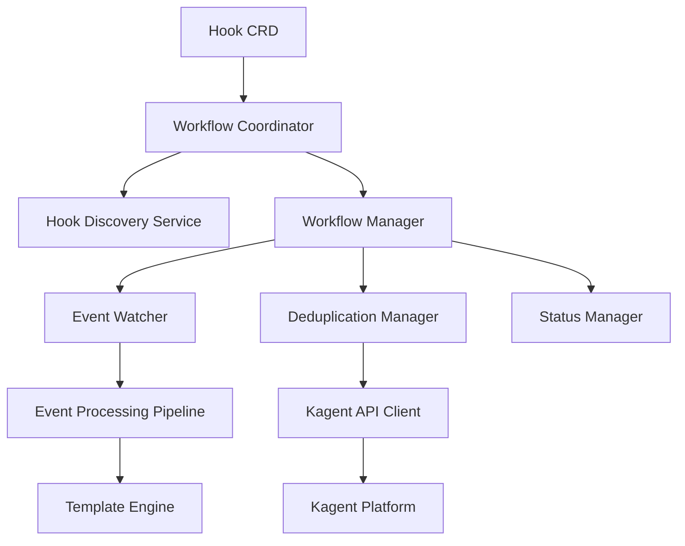
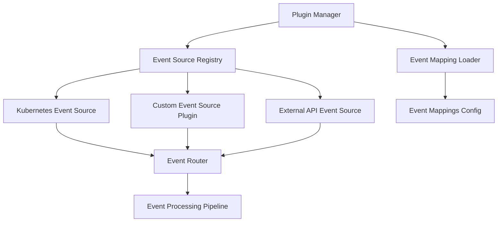
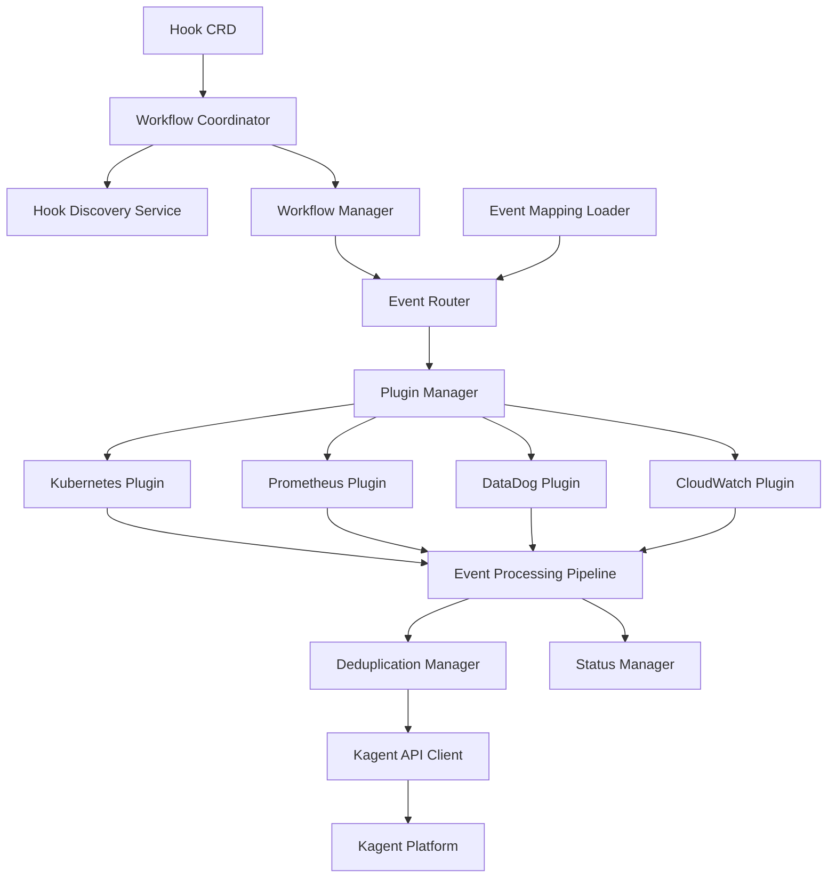
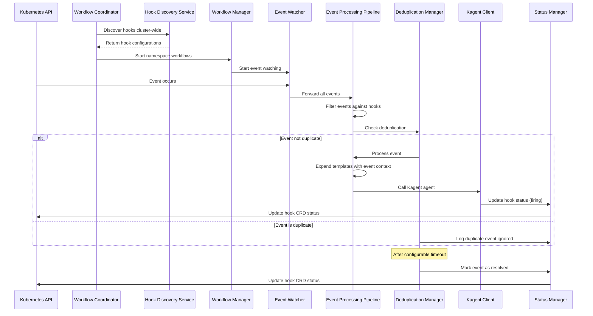

# Design Document

## Overview

The KHook Controller is a Kubernetes controller that monitors Kubernetes events and triggers autonomous remediation through Kagent agents based on configurable hook definitions. The controller uses a Custom Resource Definition (CRD) to define hook configurations and implements sophisticated deduplication logic with race condition protection.

## Architecture

The system implements a modern service-oriented architecture with the following key components:



### Core Components

1. **Hook Custom Resource**: Defines the hook configuration schema with validation
2. **Workflow Coordinator**: Orchestrates the complete event processing lifecycle
3. **Hook Discovery Service**: Cluster-wide discovery of hook configurations
4. **Workflow Manager**: Manages per-namespace event processing workflows
5. **Event Watcher**: Monitors Kubernetes events using the Events API
6. **Event Processing Pipeline**: Handles event filtering, template expansion, and agent calls
7. **Deduplication Manager**: Implements race-condition-safe deduplication with configurable timeouts
8. **Kagent API Client**: Handles secure communication with the Kagent platform via A2A protocol
9. **Status Manager**: Updates hook object status with comprehensive event tracking
10. **Template Engine**: Processes Go templates for dynamic prompt generation

## Components and Interfaces

### Hook Custom Resource Definition

The Hook CRD defines the schema for hook configurations:

```yaml
apiVersion: apiextensions.k8s.io/v1
kind: CustomResourceDefinition
metadata:
  name: hooks.kagent.dev
spec:
  group: kagent.dev
  versions:
  - name: v1alpha2
    schema:
      openAPIV3Schema:
        type: object
        properties:
          spec:
            type: object
            properties:
              eventConfigurations:
                type: array
                items:
                  type: object
                  properties:
                    eventType:
                      type: string
                      enum: ["pod-restart", "pod-pending", "oom-kill", "probe-failed"]
                    agentId:
                      type: string
                    prompt:
                      type: string
          status:
            type: object
            properties:
              activeEvents:
                type: array
                items:
                  type: object
                  properties:
                    eventType:
                      type: string
                    resourceName:
                      type: string
                    firstSeen:
                      type: string
                      format: date-time
                    lastSeen:
                      type: string
                      format: date-time
                    status:
                      type: string
                      enum: ["firing", "resolved"]
```

### Controller Manager Interface

```go
type ControllerManager interface {
    Start(ctx context.Context) error
    Stop() error
    AddHookWatch(hook *Hook) error
    RemoveHookWatch(hookName string) error
}
```

### Event Watcher Interface

```go
type EventWatcher interface {
    WatchEvents(ctx context.Context) (<-chan Event, error)
    FilterEvent(event Event, hooks []interface{}) []EventMatch
    Start(ctx context.Context) error
    Stop() error
}

type Event struct {
    Type         string
    ResourceName string
    Timestamp    time.Time
    Namespace    string
    Reason       string
    Message      string
}

type EventMatch struct {
    Hook          Hook
    Configuration EventConfiguration
    Event         Event
}
```

## Pluggable Event Watcher System

The Pluggable Event Watcher System extends the KHook Controller to support multiple event sources beyond Kubernetes events. This design uses Go's plugin system to enable dynamic loading of event source implementations at startup, allowing for extensibility and customization without modifying the core controller code.

### Architecture Overview



### Core Components

1. **Plugin Manager**: Loads and manages event source plugins at startup
2. **Event Source Registry**: Maintains registry of available event sources
3. **Event Mapping Loader**: Loads event type mappings from configuration files
4. **Event Router**: Routes events from multiple sources to processing pipeline
5. **Event Source Plugins**: Individual implementations for different event sources

### Plugin Architecture

#### Event Source Interface

```go
// EventSource defines the interface that all event source plugins must implement
type EventSource interface {
    // Name returns the unique name of the event source
    Name() string

    // Version returns the version of the event source implementation
    Version() string

    // Initialize sets up the event source with configuration
    Initialize(ctx context.Context, config map[string]interface{}) error

    // WatchEvents returns a channel of events from this source
    WatchEvents(ctx context.Context) (<-chan Event, error)

    // SupportedEventTypes returns the list of event types this source can provide
    SupportedEventTypes() []string

    // Stop gracefully shuts down the event source
    Stop() error
}

// PluginMetadata contains metadata about a loaded plugin
type PluginMetadata struct {
    Name        string
    Version     string
    Path        string
    EventTypes  []string
    Description string
}

// PluginLoader handles loading and validation of event source plugins
type PluginLoader interface {
    LoadPlugin(path string) (*PluginMetadata, EventSource, error)
    ValidatePlugin(metadata *PluginMetadata) error
    UnloadPlugin(name string) error
}
```

#### Event Mapping Configuration

Event mappings are stored in separate YAML configuration files:

```yaml
# event-mappings.yaml
mappings:
  # Kubernetes event mappings
  - eventSource: "kubernetes"
    eventType: "pod-restart"
    internalType: "PodRestart"
    description: "Pod container restart detected"
    severity: "warning"

  - eventSource: "kubernetes"
    eventType: "pod-pending"
    internalType: "PodPending"
    description: "Pod stuck in pending state"
    severity: "error"

  - eventSource: "kubernetes"
    eventType: "oom-kill"
    internalType: "OOMKill"
    description: "Process killed due to out of memory"
    severity: "critical"

  # Custom event source mappings
  - eventSource: "prometheus"
    eventType: "alert-firing"
    internalType: "PrometheusAlert"
    description: "Prometheus alert triggered"
    severity: "warning"

  - eventSource: "cloudwatch"
    eventType: "alarm-state-change"
    internalType: "CloudWatchAlarm"
    description: "AWS CloudWatch alarm state changed"
    severity: "error"

  - eventSource: "datadog"
    eventType: "monitor-alert"
    internalType: "DataDogMonitor"
    description: "DataDog monitor alert"
    severity: "warning"
```

#### Configuration Schema

```go
type EventMapping struct {
    EventSource  string            `yaml:"eventSource" json:"eventSource"`
    EventType    string            `yaml:"eventType" json:"eventType"`
    InternalType string            `yaml:"internalType" json:"internalType"`
    Description  string            `yaml:"description" json:"description"`
    Severity     string            `yaml:"severity" json:"severity"`
    Tags         map[string]string `yaml:"tags,omitempty" json:"tags,omitempty"`
}

type EventMappingConfig struct {
    Mappings []EventMapping `yaml:"mappings" json:"mappings"`
}

// EventSourceConfig defines configuration for an event source plugin
type EventSourceConfig struct {
    Name       string                 `yaml:"name" json:"name"`
    PluginPath string                 `yaml:"pluginPath" json:"pluginPath"`
    Enabled    bool                   `yaml:"enabled" json:"enabled"`
    Settings   map[string]interface{} `yaml:"settings" json:"settings"`
}

type EventWatcherConfig struct {
    MappingFile     string               `yaml:"mappingFile" json:"mappingFile"`
    PluginDirectory string               `yaml:"pluginDirectory" json:"pluginDirectory"`
    EventSources    []EventSourceConfig  `yaml:"eventSources" json:"eventSources"`
    GlobalSettings  map[string]interface{} `yaml:"globalSettings,omitempty" json:"globalSettings,omitempty"`
}
```

### Plugin Implementation Example

#### Kubernetes Event Source Plugin

```go
// plugin/kubernetes/main.go
package main

import (
    "context"
    "fmt"
    "time"

    v1 "k8s.io/api/core/v1"
    metav1 "k8s.io/apimachinery/pkg/apis/meta/v1"
    "k8s.io/apimachinery/pkg/runtime"
    "k8s.io/apimachinery/pkg/watch"
    "k8s.io/client-go/kubernetes"
    "k8s.io/client-go/rest"

    khook "github.com/kagent-dev/khook/internal/event"
)

type KubernetesEventSource struct {
    client kubernetes.Interface
    config *rest.Config
    events <-chan watch.Event
}

func (k *KubernetesEventSource) Name() string {
    return "kubernetes"
}

func (k *KubernetesEventSource) Version() string {
    return "1.0.0"
}

func (k *KubernetesEventSource) Initialize(ctx context.Context, config map[string]interface{}) error {
    // Initialize Kubernetes client
    var err error
    k.config, err = rest.InClusterConfig()
    if err != nil {
        return fmt.Errorf("failed to get in-cluster config: %w", err)
    }

    k.client, err = kubernetes.NewForConfig(k.config)
    if err != nil {
        return fmt.Errorf("failed to create kubernetes client: %w", err)
    }

    return nil
}

func (k *KubernetesEventSource) WatchEvents(ctx context.Context) (<-chan khook.Event, error) {
    eventCh := make(chan khook.Event, 100)

    // Start watching Kubernetes events
    watcher, err := k.client.CoreV1().Events("").Watch(ctx, metav1.ListOptions{})
    if err != nil {
        return nil, fmt.Errorf("failed to start event watcher: %w", err)
    }

    go func() {
        defer close(eventCh)

        for {
            select {
            case <-ctx.Done():
                watcher.Stop()
                return
            case event := <-watcher.ResultChan():
                if event.Type == watch.Added || event.Type == watch.Modified {
                    k8sEvent, ok := event.Object.(*v1.Event)
                    if !ok {
                        continue
                    }

                    // Convert Kubernetes event to internal event format
                    internalEvent := khook.Event{
                        Type:         k8sEvent.Reason,
                        ResourceName: k8sEvent.InvolvedObject.Name,
                        Timestamp:    k8sEvent.LastTimestamp.Time,
                        Namespace:    k8sEvent.Namespace,
                        Reason:       k8sEvent.Reason,
                        Message:      k8sEvent.Message,
                        Source:       "kubernetes",
                        Metadata: map[string]interface{}{
                            "kind":      k8sEvent.InvolvedObject.Kind,
                            "apiVersion": k8sEvent.InvolvedObject.APIVersion,
                            "fieldPath": k8sEvent.InvolvedObject.FieldPath,
                        },
                    }

                    select {
                    case eventCh <- internalEvent:
                    case <-ctx.Done():
                        return
                    }
                }
            }
        }
    }()

    return eventCh, nil
}

func (k *KubernetesEventSource) SupportedEventTypes() []string {
    return []string{
        "PodRestart",
        "PodPending",
        "OOMKill",
        "ProbeFailed",
        "NodeNotReady",
        "NetworkUnavailable",
    }
}

func (k *KubernetesEventSource) Stop() error {
    // Cleanup resources
    return nil
}

// Plugin entry point - this function will be called by the plugin system
func NewEventSource() khook.EventSource {
    return &KubernetesEventSource{}
}
```

#### Prometheus Alert Manager Event Source Plugin

```go
// plugin/prometheus/main.go
package main

import (
    "context"
    "crypto/tls"
    "fmt"
    "io"
    "net/http"
    "time"

    khook "github.com/kagent-dev/khook/internal/event"
)

type PrometheusEventSource struct {
    endpoint string
    client   *http.Client
    interval time.Duration
}

func (p *PrometheusEventSource) Name() string {
    return "prometheus"
}

func (p *PrometheusEventSource) Version() string {
    return "1.0.0"
}

func (p *PrometheusEventSource) Initialize(ctx context.Context, config map[string]interface{}) error {
    endpoint, ok := config["endpoint"].(string)
    if !ok {
        return fmt.Errorf("prometheus endpoint not specified")
    }
    p.endpoint = endpoint

    intervalStr, ok := config["interval"].(string)
    if !ok {
        p.interval = 30 * time.Second
    } else {
        interval, err := time.ParseDuration(intervalStr)
        if err != nil {
            return fmt.Errorf("invalid interval: %w", err)
        }
        p.interval = interval
    }

    p.client = &http.Client{
        Timeout: 10 * time.Second,
        Transport: &http.Transport{
            TLSClientConfig: &tls.Config{InsecureSkipVerify: false},
        },
    }

    return nil
}

func (p *PrometheusEventSource) WatchEvents(ctx context.Context) (<-chan khook.Event, error) {
    eventCh := make(chan khook.Event, 100)

    ticker := time.NewTicker(p.interval)
    defer ticker.Stop()

    go func() {
        defer close(eventCh)

        for {
            select {
            case <-ctx.Done():
                return
            case <-ticker.C:
                events, err := p.fetchAlerts(ctx)
                if err != nil {
                    // Log error but continue
                    continue
                }

                for _, event := range events {
                    select {
                    case eventCh <- event:
                    case <-ctx.Done():
                        return
                    }
                }
            }
        }
    }()

    return eventCh, nil
}

func (p *PrometheusEventSource) fetchAlerts(ctx context.Context) ([]khook.Event, error) {
    req, err := http.NewRequestWithContext(ctx, "GET", p.endpoint+"/api/v1/alerts", nil)
    if err != nil {
        return nil, fmt.Errorf("failed to create request: %w", err)
    }

    resp, err := p.client.Do(req)
    if err != nil {
        return nil, fmt.Errorf("failed to fetch alerts: %w", err)
    }
    defer resp.Body.Close()

    body, err := io.ReadAll(resp.Body)
    if err != nil {
        return nil, fmt.Errorf("failed to read response: %w", err)
    }

    // Parse Prometheus alert response and convert to events
    // Implementation details would depend on Prometheus API response format

    return []khook.Event{}, nil
}

func (p *PrometheusEventSource) SupportedEventTypes() []string {
    return []string{
        "PrometheusAlert",
        "AlertFiring",
        "AlertResolved",
    }
}

func (p *PrometheusEventSource) Stop() error {
    return nil
}

func NewEventSource() khook.EventSource {
    return &PrometheusEventSource{}
}
```

### Plugin Loading and Management

#### Plugin Manager Implementation

```go
type PluginManager struct {
    logger     logr.Logger
    plugins    map[string]EventSource
    metadata   map[string]*PluginMetadata
    config     *EventWatcherConfig
    pluginDir  string
}

func NewPluginManager(logger logr.Logger, config *EventWatcherConfig) *PluginManager {
    return &PluginManager{
        logger:    logger,
        plugins:   make(map[string]EventSource),
        metadata:  make(map[string]*PluginMetadata),
        config:    config,
        pluginDir: config.PluginDirectory,
    }
}

func (pm *PluginManager) LoadPlugins(ctx context.Context) error {
    for _, sourceConfig := range pm.config.EventSources {
        if !sourceConfig.Enabled {
            pm.logger.Info("Skipping disabled event source", "name", sourceConfig.Name)
            continue
        }

        pluginPath := filepath.Join(pm.pluginDir, sourceConfig.Name+".so")
        if _, err := os.Stat(pluginPath); os.IsNotExist(err) {
            pm.logger.Error(err, "Plugin file not found", "path", pluginPath)
            continue
        }

        metadata, eventSource, err := pm.loadPlugin(pluginPath)
        if err != nil {
            pm.logger.Error(err, "Failed to load plugin", "path", pluginPath)
            continue
        }

        if err := pm.validatePlugin(metadata); err != nil {
            pm.logger.Error(err, "Plugin validation failed", "name", metadata.Name)
            continue
        }

        if err := eventSource.Initialize(ctx, sourceConfig.Settings); err != nil {
            pm.logger.Error(err, "Failed to initialize event source", "name", metadata.Name)
            continue
        }

        pm.plugins[metadata.Name] = eventSource
        pm.metadata[metadata.Name] = metadata

        pm.logger.Info("Successfully loaded event source plugin",
            "name", metadata.Name,
            "version", metadata.Version,
            "eventTypes", metadata.EventTypes)
    }

    return nil
}

func (pm *PluginManager) loadPlugin(path string) (*PluginMetadata, EventSource, error) {
    plugin, err := plugin.Open(path)
    if err != nil {
        return nil, nil, fmt.Errorf("failed to open plugin: %w", err)
    }

    // Get plugin metadata
    metadataSym, err := plugin.Lookup("PluginMetadata")
    if err != nil {
        return nil, nil, fmt.Errorf("failed to find PluginMetadata symbol: %w", err)
    }

    metadata, ok := metadataSym.(*PluginMetadata)
    if !ok {
        return nil, nil, fmt.Errorf("PluginMetadata symbol has wrong type")
    }

    // Get plugin constructor
    constructorSym, err := plugin.Lookup("NewEventSource")
    if err != nil {
        return nil, nil, fmt.Errorf("failed to find NewEventSource symbol: %w", err)
    }

    constructor, ok := constructorSym.(func() EventSource)
    if !ok {
        return nil, nil, fmt.Errorf("NewEventSource symbol has wrong type")
    }

    eventSource := constructor()
    return metadata, eventSource, nil
}

func (pm *PluginManager) validatePlugin(metadata *PluginMetadata) error {
    if metadata.Name == "" {
        return fmt.Errorf("plugin name cannot be empty")
    }

    if len(metadata.EventTypes) == 0 {
        return fmt.Errorf("plugin must support at least one event type")
    }

    // Check for duplicate event types across plugins
    for name, existingMetadata := range pm.metadata {
        for _, existingType := range existingMetadata.EventTypes {
            for _, newType := range metadata.EventTypes {
                if existingType == newType {
                    return fmt.Errorf("event type '%s' already provided by plugin '%s'", newType, name)
                }
            }
        }
    }

    return nil
}

func (pm *PluginManager) GetEventSource(name string) (EventSource, bool) {
    source, exists := pm.plugins[name]
    return source, exists
}

func (pm *PluginManager) GetAllEventSources() map[string]EventSource {
    return pm.plugins
}

func (pm *PluginManager) StopAll() error {
    var errors []error

    for name, source := range pm.plugins {
        if err := source.Stop(); err != nil {
            pm.logger.Error(err, "Failed to stop event source", "name", name)
            errors = append(errors, fmt.Errorf("failed to stop %s: %w", name, err))
        }
    }

    if len(errors) > 0 {
        return fmt.Errorf("multiple stop errors: %v", errors)
    }

    return nil
}
```

### Event Mapping Loader

```go
type EventMappingLoader struct {
    logger logr.Logger
    mappings map[string]*EventMapping
}

func NewEventMappingLoader(logger logr.Logger) *EventMappingLoader {
    return &EventMappingLoader{
        logger:   logger,
        mappings: make(map[string]*EventMapping),
    }
}

func (eml *EventMappingLoader) LoadMappings(filePath string) error {
    data, err := ioutil.ReadFile(filePath)
    if err != nil {
        return fmt.Errorf("failed to read mapping file: %w", err)
    }

    var config EventMappingConfig
    if err := yaml.Unmarshal(data, &config); err != nil {
        return fmt.Errorf("failed to parse mapping file: %w", err)
    }

    for _, mapping := range config.Mappings {
        key := fmt.Sprintf("%s:%s", mapping.EventSource, mapping.EventType)
        eml.mappings[key] = &mapping
        eml.logger.Info("Loaded event mapping",
            "source", mapping.EventSource,
            "eventType", mapping.EventType,
            "internalType", mapping.InternalType,
            "severity", mapping.Severity)
    }

    eml.logger.Info("Successfully loaded event mappings",
        "count", len(config.Mappings),
        "file", filePath)

    return nil
}

func (eml *EventMappingLoader) GetMapping(eventSource, eventType string) (*EventMapping, bool) {
    key := fmt.Sprintf("%s:%s", eventSource, eventType)
    mapping, exists := eml.mappings[key]
    return mapping, exists
}

func (eml *EventMappingLoader) GetAllMappings() map[string]*EventMapping {
    return eml.mappings
}
```

### Configuration Files

#### Main Event Watcher Configuration

```yaml
# event-watcher-config.yaml
mappingFile: "/etc/khook/event-mappings.yaml"
pluginDirectory: "/opt/khook/plugins"

eventSources:
  - name: "kubernetes"
    pluginPath: "/opt/khook/plugins/kubernetes.so"
    enabled: true
    settings:
      namespaces: ["default", "kube-system"]
      eventTypes: ["PodRestart", "OOMKill", "ProbeFailed"]

  - name: "prometheus"
    pluginPath: "/opt/khook/plugins/prometheus.so"
    enabled: true
    settings:
      endpoint: "http://prometheus.example.com:9093"
      interval: "30s"
      alertLabels:
        - severity: "critical"
        - team: "platform"

  - name: "datadog"
    pluginPath: "/opt/khook/plugins/datadog.so"
    enabled: false
    settings:
      apiKey: "${DATADOG_API_KEY}"
      appKey: "${DATADOG_APP_KEY}"
      interval: "60s"

globalSettings:
  bufferSize: 1000
  workerCount: 5
  retryAttempts: 3
  retryBackoff: "5s"
```

### Updated Architecture with Pluggable Event Sources



### Benefits

1. **Extensibility**: New event sources can be added without modifying core code
2. **Isolation**: Plugins run in separate processes, preventing crashes from affecting the main controller
3. **Dynamic Loading**: Event sources can be loaded/unloaded at runtime
4. **Type Safety**: Go's type system ensures plugin compatibility
5. **Configuration**: Event mappings and plugin settings are externalized
6. **Versioning**: Each plugin has its own version for compatibility management
7. **Security**: Plugins can be validated before loading

### Implementation Considerations

1. **Plugin Compilation**: Plugins must be compiled with the same Go version and dependencies
2. **ABI Compatibility**: Plugin interfaces must maintain backward compatibility
3. **Error Handling**: Plugin failures shouldn't crash the main controller
4. **Resource Management**: Plugins should clean up resources properly on shutdown
5. **Testing**: Each plugin should have comprehensive unit and integration tests
6. **Documentation**: Clear documentation for plugin development and configuration

### Kagent API Client Interface

```go
type KagentClient interface {
    CallAgent(ctx context.Context, request AgentRequest) (*AgentResponse, error)
    Authenticate() error
}

type AgentRequest struct {
    AgentId      string
    Prompt       string
    EventName    string
    EventTime    time.Time
    ResourceName string
    Context      map[string]interface{}
}

type AgentResponse struct {
    Success   bool
    Message   string
    RequestId string
}
```

### Deduplication Manager Interface

```go
type DeduplicationManager interface {
    ShouldProcessEvent(hookName string, event Event) bool
    RecordEvent(hookName string, event Event) error
    CleanupExpiredEvents(hookName string) error
    GetActiveEvents(hookName string) []ActiveEvent
    GetActiveEventsWithStatus(hookName string) []ActiveEvent
    MarkNotified(hookName string, event Event)
}

type ActiveEvent struct {
    EventType      string
    ResourceName   string
    FirstSeen      time.Time
    LastSeen       time.Time
    Status         string
    NotifiedAt     *time.Time
    LastNotifiedAt *time.Time
}
```

## Data Models

### Hook Specification

```go
type Hook struct {
    metav1.TypeMeta   `json:",inline"`
    metav1.ObjectMeta `json:"metadata,omitempty"`
    
    Spec   HookSpec   `json:"spec,omitempty"`
    Status HookStatus `json:"status,omitempty"`
}

type HookSpec struct {
    EventConfigurations []EventConfiguration `json:"eventConfigurations"`
}

type EventConfiguration struct {
    EventType string `json:"eventType"`
    AgentId   string `json:"agentId"`
    Prompt    string `json:"prompt"`
}

type HookStatus struct {
    ActiveEvents []ActiveEventStatus `json:"activeEvents,omitempty"`
    LastUpdated  metav1.Time         `json:"lastUpdated,omitempty"`
}

type ActiveEventStatus struct {
    EventType      string      `json:"eventType"`
    ResourceName   string      `json:"resourceName"`
    FirstSeen      metav1.Time `json:"firstSeen"`
    LastSeen       metav1.Time `json:"lastSeen"`
    Status         string      `json:"status"`
    NotifiedAt     *metav1.Time `json:"notifiedAt,omitempty"`
    LastNotifiedAt *metav1.Time `json:"lastNotifiedAt,omitempty"`
}


```

## Event Processing Flow



## Security Features

### Template Security
- ✅ Dangerous construct detection ({{define}}, {{call}}, {{data}}, etc.)
- ✅ Input validation for template expressions
- ✅ Length limits to prevent resource exhaustion
- ✅ Bracket matching validation
- ✅ Graceful fallback for malformed templates

### Input Validation
- ✅ Comprehensive Hook configuration validation
- ✅ Kubernetes resource name validation
- ✅ Agent ID format validation
- ✅ Client configuration validation
- ✅ URL and authentication validation

### Event Processing
- ✅ Race-condition-safe event processing
- ✅ Template-based prompt generation for Kagent
- ✅ Comprehensive error handling and recovery
- ✅ Efficient deduplication and status tracking

## Error Handling

### Kagent API Failures
- ✅ Exponential backoff retry logic with configurable attempts
- ✅ Detailed error logging with request/response context
- ✅ Hook status updates with error information
- ✅ Kubernetes event emission for monitoring integration
- ✅ Circuit breaker pattern for repeated failures

### Event Processing Errors
- ✅ Continue processing other events if one fails
- ✅ Contextual error logging (hook name, event details)
- ✅ Individual hook status updates without affecting others
- ✅ Graceful degradation with fallback mechanisms

### Controller Lifecycle Errors
- ✅ Graceful shutdown with proper workflow cleanup
- ✅ Recovery from API server disconnections
- ✅ Comprehensive CRD schema validation
- ✅ Leader election for high availability deployments
- ✅ Service-oriented architecture for fault isolation

## Testing Strategy

### Unit Tests
- ✅ Mock Kubernetes API interactions using fake clients
- ✅ Test event filtering logic with various event types
- ✅ Validate race-condition-safe deduplication with time-based scenarios
- ✅ Test Kagent API client with mock HTTP responses and A2A protocol
- ✅ Verify comprehensive CRD validation and status updates
- ✅ Test template expansion with security validation
- ✅ Validate service architecture components

### Integration Tests
- ✅ Deploy controller in test Kubernetes cluster with Helm
- ✅ Create hook objects and verify autonomous event monitoring
- ✅ Trigger actual Kubernetes events and validate agent responses
- ✅ Test controller restart and recovery with workflow coordination
- ✅ Validate proper cleanup when hooks are deleted
- ✅ Test per-namespace workflow management
- ✅ Verify template expansion and autonomous execution

### End-to-End Tests
- ✅ Full workflow testing with real Kagent platform
- ✅ Performance testing with high event volumes and deduplication
- ✅ Multi-hook scenarios with overlapping event types
- ✅ Failure recovery testing with network partitions and retries
- ✅ Upgrade testing for CRD schema changes from v1alpha1 to v1alpha2
- ✅ Security validation testing for template injection prevention
- ✅ Dark mode logo testing and theme adaptation

### Security Testing
- ✅ Template injection prevention and validation
- ✅ Input sanitization for all user-provided data
- ✅ Race condition testing for concurrent event processing
- ✅ Authentication and authorization validation
- ✅ API security testing with malformed requests

### Performance Testing
- ✅ Event processing throughput with 100+ hooks
- ✅ Memory usage validation with large event volumes
- ✅ Template processing performance with complex expressions
- ✅ Deduplication efficiency under high load
- ✅ Database/memory storage performance for event state