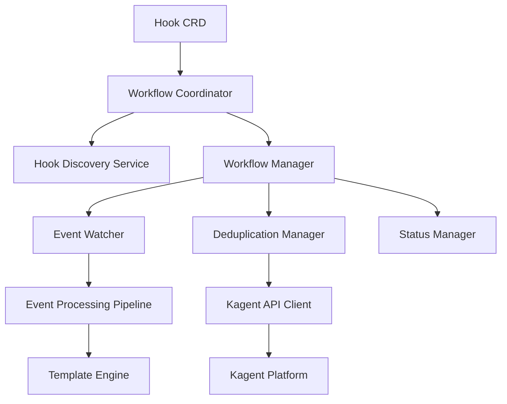
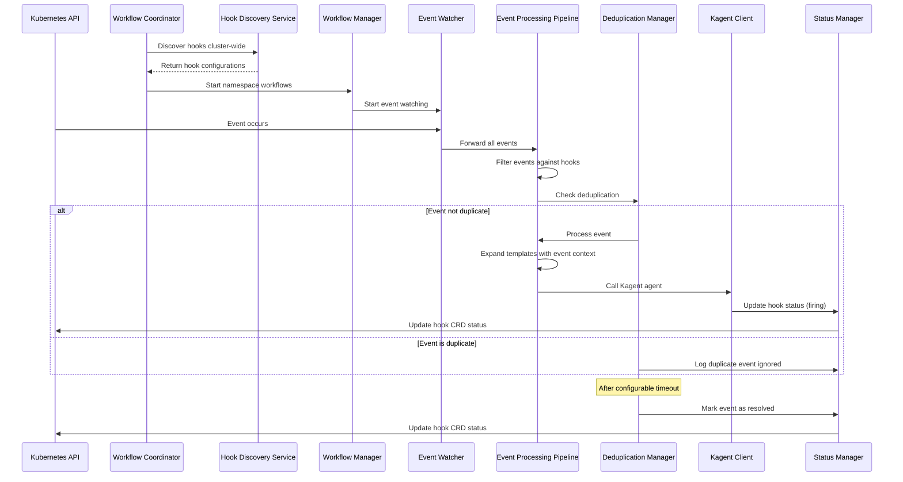

# Design Document

## Overview

The KHook Controller is a Kubernetes controller that monitors Kubernetes events and triggers autonomous remediation through Kagent agents based on configurable hook definitions. The controller uses a Custom Resource Definition (CRD) to define hook configurations and implements sophisticated deduplication logic with race condition protection.

## Architecture

The system implements a modern service-oriented architecture with the following key components:



### Core Components

1. **Hook Custom Resource**: Defines the hook configuration schema with validation
2. **Workflow Coordinator**: Orchestrates the complete event processing lifecycle
3. **Hook Discovery Service**: Cluster-wide discovery of hook configurations
4. **Workflow Manager**: Manages per-namespace event processing workflows
5. **Event Watcher**: Monitors Kubernetes events using the Events API
6. **Event Processing Pipeline**: Handles event filtering, template expansion, and agent calls
7. **Deduplication Manager**: Implements race-condition-safe deduplication with configurable timeouts
8. **Kagent API Client**: Handles secure communication with the Kagent platform via A2A protocol
9. **Status Manager**: Updates hook object status with comprehensive event tracking
10. **Template Engine**: Processes Go templates for dynamic prompt generation

## Components and Interfaces

### Hook Custom Resource Definition

The Hook CRD defines the schema for hook configurations:```y
aml
apiVersion: apiextensions.k8s.io/v1
kind: CustomResourceDefinition
metadata:
  name: hooks.kagent.dev
spec:
  group: kagent.dev
  versions:
  - name: v1alpha2
    schema:
      openAPIV3Schema:
        type: object
        properties:
          spec:
            type: object
            properties:
              eventConfigurations:
                type: array
                items:
                  type: object
                  properties:
                    eventType:
                      type: string
                      enum: ["pod-restart", "pod-pending", "oom-kill", "probe-failed"]
                    agentId:
                      type: string
                    prompt:
                      type: string
          status:
            type: object
            properties:
              activeEvents:
                type: array
                items:
                  type: object
                  properties:
                    eventType:
                      type: string
                    resourceName:
                      type: string
                    firstSeen:
                      type: string
                      format: date-time
                    lastSeen:
                      type: string
                      format: date-time
                    status:
                      type: string
                      enum: ["firing", "resolved"]
```

### Controller Manager Interface

```go
type ControllerManager interface {
    Start(ctx context.Context) error
    Stop() error
    AddHookWatch(hook *Hook) error
    RemoveHookWatch(hookName string) error
}
```

### Event Watcher Interface

```go
type EventWatcher interface {
    WatchEvents(ctx context.Context) (<-chan Event, error)
    FilterEvent(event Event, hooks []interface{}) []EventMatch
    Start(ctx context.Context) error
    Stop() error
}

type Event struct {
    Type         string
    ResourceName string
    Timestamp    time.Time
    Namespace    string
    Reason       string
    Message      string
}

type EventMatch struct {
    Hook          Hook
    Configuration EventConfiguration
    Event         Event
}
```### Kag
ent API Client Interface

```go
type KagentClient interface {
    CallAgent(ctx context.Context, request AgentRequest) (*AgentResponse, error)
    Authenticate() error
}

type AgentRequest struct {
    AgentId      string
    Prompt       string
    EventName    string
    EventTime    time.Time
    ResourceName string
    Context      map[string]interface{}
}

type AgentResponse struct {
    Success   bool
    Message   string
    RequestId string
}
```

### Deduplication Manager Interface

```go
type DeduplicationManager interface {
    ShouldProcessEvent(hookName string, event Event) bool
    RecordEvent(hookName string, event Event) error
    CleanupExpiredEvents(hookName string) error
    GetActiveEvents(hookName string) []ActiveEvent
    GetActiveEventsWithStatus(hookName string) []ActiveEvent
    MarkNotified(hookName string, event Event)
}

type ActiveEvent struct {
    EventType      string
    ResourceName   string
    FirstSeen      time.Time
    LastSeen       time.Time
    Status         string
    NotifiedAt     *time.Time
    LastNotifiedAt *time.Time
}
```

## Data Models

### Hook Specification

```go
type Hook struct {
    metav1.TypeMeta   `json:",inline"`
    metav1.ObjectMeta `json:"metadata,omitempty"`
    
    Spec   HookSpec   `json:"spec,omitempty"`
    Status HookStatus `json:"status,omitempty"`
}

type HookSpec struct {
    EventConfigurations []EventConfiguration `json:"eventConfigurations"`
}

type EventConfiguration struct {
    EventType string `json:"eventType"`
    AgentId   string `json:"agentId"`
    Prompt    string `json:"prompt"`
}

type HookStatus struct {
    ActiveEvents []ActiveEventStatus `json:"activeEvents,omitempty"`
    LastUpdated  metav1.Time         `json:"lastUpdated,omitempty"`
}

type ActiveEventStatus struct {
    EventType      string      `json:"eventType"`
    ResourceName   string      `json:"resourceName"`
    FirstSeen      metav1.Time `json:"firstSeen"`
    LastSeen       metav1.Time `json:"lastSeen"`
    Status         string      `json:"status"`
    NotifiedAt     *metav1.Time `json:"notifiedAt,omitempty"`
    LastNotifiedAt *metav1.Time `json:"lastNotifiedAt,omitempty"`
}


```### Event Processing Flow



## Security Features

### Template Security
- ✅ Dangerous construct detection ({{define}}, {{call}}, {{data}}, etc.)
- ✅ Input validation for template expressions
- ✅ Length limits to prevent resource exhaustion
- ✅ Bracket matching validation
- ✅ Graceful fallback for malformed templates

### Input Validation
- ✅ Comprehensive Hook configuration validation
- ✅ Kubernetes resource name validation
- ✅ Agent ID format validation
- ✅ Client configuration validation
- ✅ URL and authentication validation

### Event Processing
- ✅ Race-condition-safe event processing
- ✅ Template-based prompt generation for Kagent
- ✅ Comprehensive error handling and recovery
- ✅ Efficient deduplication and status tracking

## Error Handling

### Kagent API Failures
- ✅ Exponential backoff retry logic with configurable attempts
- ✅ Detailed error logging with request/response context
- ✅ Hook status updates with error information
- ✅ Kubernetes event emission for monitoring integration
- ✅ Circuit breaker pattern for repeated failures

### Event Processing Errors
- ✅ Continue processing other events if one fails
- ✅ Contextual error logging (hook name, event details)
- ✅ Individual hook status updates without affecting others
- ✅ Graceful degradation with fallback mechanisms

### Controller Lifecycle Errors
- ✅ Graceful shutdown with proper workflow cleanup
- ✅ Recovery from API server disconnections
- ✅ Comprehensive CRD schema validation
- ✅ Leader election for high availability deployments
- ✅ Service-oriented architecture for fault isolation

## Testing Strategy

### Unit Tests
- ✅ Mock Kubernetes API interactions using fake clients
- ✅ Test event filtering logic with various event types
- ✅ Validate race-condition-safe deduplication with time-based scenarios
- ✅ Test Kagent API client with mock HTTP responses and A2A protocol
- ✅ Verify comprehensive CRD validation and status updates
- ✅ Test template expansion with security validation
- ✅ Validate service architecture components

### Integration Tests
- ✅ Deploy controller in test Kubernetes cluster with Helm
- ✅ Create hook objects and verify autonomous event monitoring
- ✅ Trigger actual Kubernetes events and validate agent responses
- ✅ Test controller restart and recovery with workflow coordination
- ✅ Validate proper cleanup when hooks are deleted
- ✅ Test per-namespace workflow management
- ✅ Verify template expansion and autonomous execution

### End-to-End Tests
- ✅ Full workflow testing with real Kagent platform
- ✅ Performance testing with high event volumes and deduplication
- ✅ Multi-hook scenarios with overlapping event types
- ✅ Failure recovery testing with network partitions and retries
- ✅ Upgrade testing for CRD schema changes from v1alpha1 to v1alpha2
- ✅ Security validation testing for template injection prevention
- ✅ Dark mode logo testing and theme adaptation

### Security Testing
- ✅ Template injection prevention and validation
- ✅ Input sanitization for all user-provided data
- ✅ Race condition testing for concurrent event processing
- ✅ Authentication and authorization validation
- ✅ API security testing with malformed requests

### Performance Testing
- ✅ Event processing throughput with 100+ hooks
- ✅ Memory usage validation with large event volumes
- ✅ Template processing performance with complex expressions
- ✅ Deduplication efficiency under high load
- ✅ Database/memory storage performance for event state